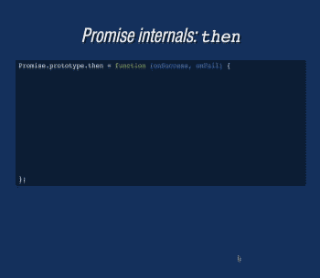
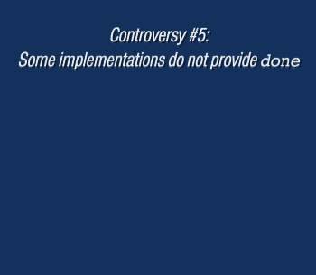

# bespoke-substeps
## Substeps for [Bespoke.js](https://github.com/markdalgleish/bespoke.js) presentations

### Similar and initially inspired on [bespoke-bullets](https://github.com/markdalgleish/bespoke-bullets).

    

You can see _bespoke-substeps_ in action in e.g. [Asynchronous JavaScript Interfaces](http://medikoo.com/asynchronous-javascript-interfaces/?notes) presentation

#### Features

* Order of display can be customized (via `data-order` attribute), so it doesn't necessary need to follow order in document
* Separated steps can be configured to appear in parallel (just apply same `data-order` value)
* There are four types of actions (configured via `data-action` attribute) that can be used:
  * __activate__ (default) show element (turn off `visibility: hidden`)
  * __deactivate__ hide element (turn on `visibility: hidden`)
  * __insert__ insert element (turn off `display: none`)
  * __remove__ remove element (turn on `display: none`)
  * __mark__ mark element (just for duration of given step turn off `background: inherit`)
    
  How it works: _step_ remains in opposite state to configured action until it has it's turn. Anytime later configured action is in effect, just in case of _mark_ action, configure state is maintained only for time of given step.


### Usage

If CJS bundler you're using, supports CSS modules out of a box, then just do `require('bespoke-substeps')`.  
Otherwise require strictly JS logic of plugin with `require('bespoke-substeps/dom')` and manually assure that styles placed in `style.css` are also loaded with your application.

```javascript
// Only if CJS bunlder supports CSS modules (otherwise 'bespoke-substeps/dom'):
var substeps = require('bespoke-substeps');

bespoke.from(selector, [
  substeps()
]);
```

Example HTML configuration

All step elements need to share `substep` class. Unless overridden they're assigned with `activate` action and incremented order.

```html
<section class="bespoke-slide">
  <h1>Slide title</h1>
  <ul class="substep" data-order="3" data-action="remove"><!-- Removed in final step -->
    <li class="substep">First step</li><!-- assigned  order: 0.01 -->
    <li class="substep">Second step</li><!-- assigned order: 0.02 -->
    <li class="substep" data-order="2">Fourth step (1)</p><!-- assigned  order: 2 -->
    <li class="substep" data-order="1">Third step</p><!-- assigned  order: 1 -->
    <li class="substep" data-order="2">Fourth step (2)</p><!-- assigned  order: 2 -->
    <li class="substep">Fifth step</p><!-- assigned  order: 2.01 -->
  </ul>
  <ul class="substep" data-order="3" data-action="insert"><!-- Inserted in final step -->
    <li>Final only item</li>
  </ul>
</section>
```

### Installation
#### npm

In your presentation path:

	$ npm install bespoke-substeps
